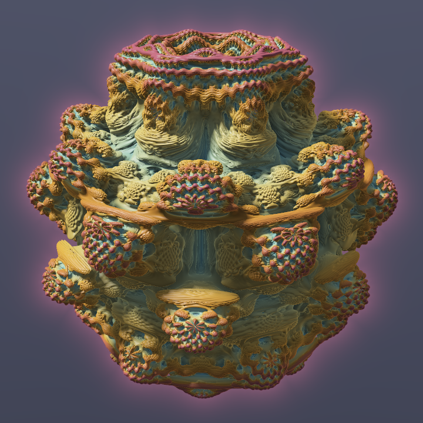
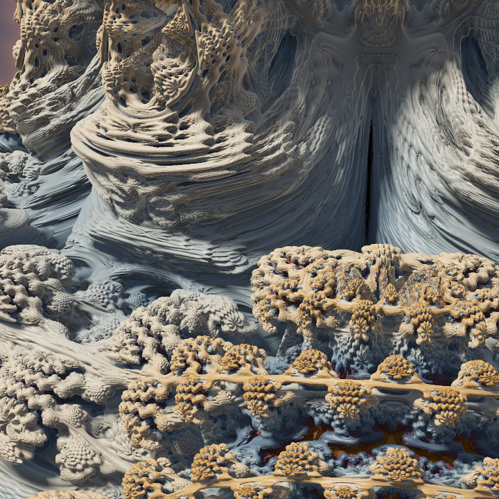
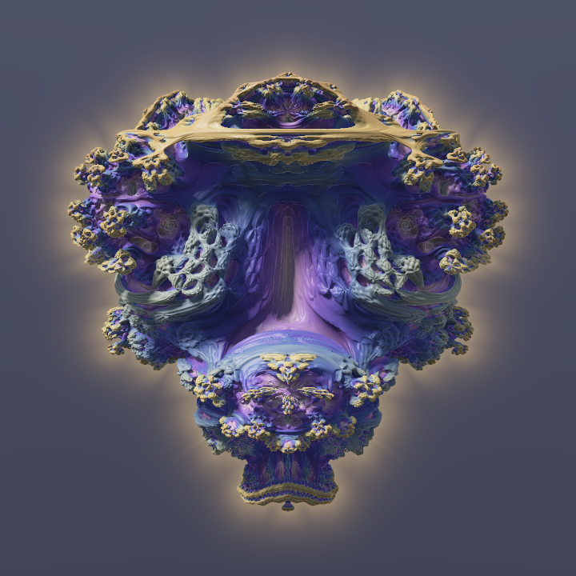

# Mandelbulb

A pure-Python Mandelbulb raymarcher with an interactive Plotly Dash explorer. The design follows [Dash-Fractal-Explorer](https://github.com/SterlingButters/Dash-Fractal-Explorer), and the look aims for the renders on [Skytopia](https://www.skytopia.com/project/fractal/mandelbulb.html).

| Classic power 8 | Zoom ×4.9 | Power 4 |
|---|---|---|
|  |  |  |

## Quick start

```bash
pip install -r requirements.txt
python app.py          # open http://127.0.0.1:8050
```

The first launch compiles the Numba kernels, which takes about 30 s. The compiled code is cached, so later launches are almost instant.

## Explorer (`app.py`)

- **Click the image** to fly toward that point. The click action can be set to *Zoom in ×2*, *Recentre* or *Zoom out*. The camera stays on the ray it just marched, so it never ends up inside the fractal.
- **Fractal:** power (2–16), iterations, detail (the hit tolerance in pixels) and Julia mode with sliders for c. The Preset menu has some starting points.
- **Camera:** azimuth, elevation and field of view, plus Zoom in, Zoom out and Reset buttons. The readout under the image shows the zoom, target and angles. You can paste those into `render.py`.
- **Look:** cosine palettes, colour frequency and offset, glow, soft shadows, ambient occlusion and fog.
- **Export:** downloads a PNG of up to 3072 px with 2×2 or 3×3 anti-aliasing.

Tip: when you zoom in past about ×50, raise **Iterations** (16–30) to resolve finer detail.

## Real-time WebGL version (`web/index.html`)

Open `web/index.html` in any recent browser. It needs no server or install, just WebGL 2. The same distance estimator and shading run as a GLSL fragment shader, so the fractal renders in real time.

- **Navigation:** drag to orbit, scroll or pinch to zoom, double-click or double-tap to fly to a point. <kbd>H</kbd> hides the panel and <kbd>R</kbd> resets the view.
- **Resolution:** the preview resolution adapts while you move to keep the frame rate up. Once the view is still, the page renders at full resolution and adds anti-aliasing samples one frame at a time.
- **Motion:** auto-rotate, *Breathe power* (the power swings between 4.5 and 11.5) and *Orbit Julia c*, which morphs the Julia bulb live.
- **Snapshot** saves the converged frame as a PNG. **Copy render.py command** writes the exact `render.py` call that recreates the current view at print size.

The GPU computes in float32, so detail breaks down beyond roughly ×3000 zoom. Use the Python renderer, which is float64, for deeper dives.

## Command-line renderer (`render.py`)

```bash
python render.py still -o bulb.png --size 2048 --ss 2
python render.py still --target 0.5443 0.1203 0.5253 --az 33.5 --el 20 --zoom 4.9 --palette Ember
python render.py turntable --frames 120 --size 512 --gif spin.gif
python render.py morph --from-power 2 --to-power 12 --frames 90 --gif morph.gif
python render.py zoom --target 0.5443 0.1203 0.5253 --az 33.5 --el 20 --zoom-to 500 --gif dive.gif
```

Run `python render.py <cmd> -h` to see every option. For `zoom`, take the target, az and el from the explorer's readout after clicking a point. That keeps the flight path in empty space.

## How it works

`mandelbulb/renderer.py` is a sphere tracer compiled with Numba (`@njit(parallel=True)`, float64).

1. **Distance estimator.** The White–Nylander triplex power formula, with a running derivative:
   - r, θ, φ = spherical(z)
   - z ← rⁿ·(sin nθ cos nφ, sin nθ sin nφ, cos nθ) + c
   - dr ← n·rⁿ⁻¹·dr + 1
   - DE = ½·ln r · r / dr
2. **Raymarching.** Each ray is clipped to a bounding sphere, then stepped forward by `DE × fudge`. The hit tolerance scales with distance × pixel footprint, so detail is pixel-accurate at any zoom.
3. **Shading.**
   - Normals come from a tetrahedral gradient.
   - Lighting is a soft-shadowed key light, sky ambient, fill, Blinn-Phong specular and Fresnel rim.
   - Ambient occlusion combines 5 samples along the normal with a step-count term.
   - Colour comes from an orbit trap (min |z|) run through an Inigo Quilez cosine palette.
4. **Misses.** The background is a gradient plus a glow based on how close the ray passed to the surface.

A 480² preview takes about 0.5–2 s on a typical 4–8 core CPU. Renders are serialised with a lock, because Numba's thread pool is not re-entrant under Dash's threaded server.

## Layout

```
app.py                 Dash explorer
web/index.html         real-time WebGL 2 explorer (single file)
render.py              CLI: still / turntable / morph / zoom
mandelbulb/renderer.py raymarcher, camera, picking
mandelbulb/palettes.py cosine palettes
assets/style.css       dark theme for the Dash app
images/                sample renders
```
